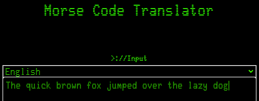
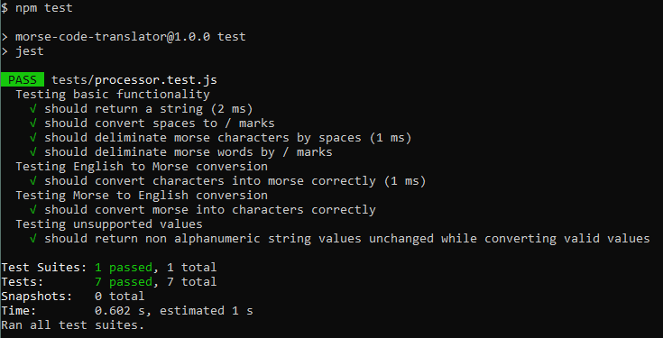

# Morse Code Translator

## Description:
A webpage that allows a user to input either `English` or `Morse Code` and convert between the two.

### How to install/run the project:
This site is hosted at the following link:
[https://jesse-dejong.github.io/morse-code-translator/]()

### Implementation:
My main goal going into this project (outside core functionality) was for it to update live as the user typed their query. This dynamic rerendering usually prompts the use of a framework such as react however after some research a way for this to be achieved while implementing the project in Vanilla JS emerged. This is mainly desireable due to the scope of the project not benefiting from the feature-set of a framework which if used would have added bulk and complexity to the program. Utilising Vanilla JS for this project keeps it lightweight, easy to read and maintain while providing all the required tools for the envisioned implementation. Additionally this made intergrating testing far more straightforward and futureproofs the implementation against framework updates.

### Future goals/extensions:
- If the user changes mode remove old text [`added`]
- Audio output for the morse code being returned
- Capitalisation at the start of a returned sentence
- Sentence 'detection'
- Handling for punctuation beyond spaces when translating from Morse to English
- Alter handling of characters Morse Code does not support (current implementation allows for these values to be passed unconverted) 

### Tests:
Test coverage in this project includes the following:
- Basic Functionality [return a string, convert spaces to /, deliminate morse characters by spaces, deliminate morse words by /]
- Correctly converting a given string of english to morse
- Correctly converting a given string of morse to english
- Handling of unsupported english characters [eg. "*$!%"]

The tests are available in the `./tests` directory and can be performed with the command `npm test` after completing an `npm install`.

### MVP:
- Must support the alphabet, spaces, numbers
- Must give user feedback when they input unsupported characters
- Must be able to translate both ways
- Project must use javascript modules to seperate dom logic from vanilla js logic
- Can use react, or vanilla js.
- Functions you write must be unit tested (you won't be able to write unit tests for function that interact with the dom)
- Must look NICE, this will go on your portfolio

### License:
Permission is hereby granted, free of charge, to any person obtaining a copy of this software and associated documentation files (the "Software"), to deal in the Software without restriction, including without limitation the rights to use, copy, modify, merge, publish, distribute, sublicense, and/or sell copies of the Software, and to permit persons to whom the Software is furnished to do so, subject to the following conditions:

The above copyright notice and this permission notice shall be included in all copies or substantial portions of the Software.

THE SOFTWARE IS PROVIDED "AS IS", WITHOUT WARRANTY OF ANY KIND, EXPRESS OR IMPLIED, INCLUDING BUT NOT LIMITED TO THE WARRANTIES OF MERCHANTABILITY, FITNESS FOR A PARTICULAR PURPOSE AND NONINFRINGEMENT. IN NO EVENT SHALL THE AUTHORS OR COPYRIGHT HOLDERS BE LIABLE FOR ANY CLAIM, DAMAGES OR OTHER LIABILITY, WHETHER IN AN ACTION OF CONTRACT, TORT OR OTHERWISE, ARISING FROM, OUT OF OR IN CONNECTION WITH THE SOFTWARE OR THE USE OR OTHER DEALINGS IN THE SOFTWARE.